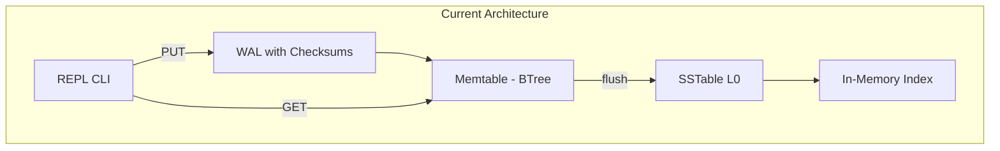
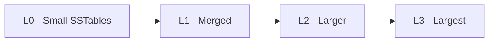
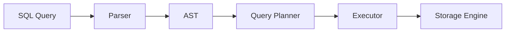

# Database Learning Project Roadmap

## Current State Summary

You have built a solid LSM-tree based key-value store foundation:



**Completed:**

- REPL with GET/PUT/EXIT commands
- WAL with `[length][payload][CRC32]` format and corruption detection
- Memtable using Google BTree with size-based flushing
- SSTable L0 with block-based format, index block, and footer
- Index loading on startup

---

## Short-Term Goals (1-2 weeks)

### 1. Complete SSTable Read Path

Currently writes work, but reads don't query SSTables. Implement:

- Binary search on in-memory index to find the right block
- Read block from disk using offset
- Linear scan within block to find key
- Search order: Memtable -> newest SSTable -> oldest SSTable

### 2. Add DELETE Support

- Add tombstone markers (e.g., `DEL key` or special value)
- Handle tombstones in GET (return not found)
- Propagate tombstones during compaction

### 3. Improve Data Format Robustness

- Handle newlines/special characters in keys/values (use length-prefixed encoding everywhere)
- Add checksums to SSTable blocks (not just WAL)

### 4. Add More Tests

- WAL recovery (partial writes, corruption)
- SSTable read path (single block, multi-block)
- End-to-end: PUT -> flush -> GET from SSTable
- DELETE with tombstones

---

## Medium-Term Goals (1-2 months)

### 5. Implement Bloom Filters

- Add per-SSTable bloom filter to avoid unnecessary disk reads
- Store bloom filter in SSTable file (before index block)
- Query bloom filter before searching index

### 6. Add Compaction

- Merge multiple L0 SSTables into one
- Remove duplicate keys (keep newest)
- Remove tombstones for deleted keys
- Trigger compaction when L0 file count exceeds threshold

### 7. Multi-Level LSM Tree



- L0: Direct memtable flushes (overlapping keys allowed)
- L1+: Compacted, non-overlapping key ranges
- Size-tiered or leveled compaction strategy

### 8. Graceful Shutdown

- Handle SIGTERM/SIGINT signals
- Flush memtable to SSTable before exit
- Truncate partial WAL writes

---

## Long-Term Goals (3-6 months) - Toward SQL

### 9. Storage Engine Abstraction

Refactor KV store into a clean interface:

```go
type StorageEngine interface {
    Get(key []byte) ([]byte, error)
    Put(key []byte, value []byte) error
    Delete(key []byte) error
    Scan(start, end []byte) Iterator
}
```

### 10. Table Storage Layer

- Encode rows as key-value pairs: `table_id:row_id -> serialized_row`
- Add schema storage: `schema:table_name -> column_definitions`
- Implement row serialization (consider Protocol Buffers or custom format)

### 11. SQL Parser

- Use a parser generator or hand-write recursive descent parser
- Start with: `CREATE TABLE`, `INSERT`, `SELECT ... WHERE`, `DELETE`
- Libraries to consider: `github.com/xwb1989/sqlparser`

### 12. Query Execution



- Build execution operators: TableScan, Filter, Project
- Execute against storage engine

### 13. Secondary Indexes

- Store index entries: `index_name:column_value -> row_id`
- Use indexes in query planning for WHERE clauses

### 14. Transactions (Optional Advanced)

- MVCC (Multi-Version Concurrency Control)
- Transaction log
- Isolation levels

---

## Suggested Reading Order

| Topic | Resource |

|-------|----------|

| LSM Trees | [RocksDB Wiki](https://github.com/facebook/rocksdb/wiki) |

| B-Trees | "Database Internals" by Alex Petrov (Ch 2-4) |

| SQL Parsing | Writing an Interpreter in Go (concepts apply) |

| Query Execution | "Architecture of a Database System" paper |

| Transactions | "Designing Data-Intensive Applications" Ch 7 |

---

## Immediate Next Steps

1. **SSTable Read Path** - This is the critical missing piece to make your KV store functional
2. **DELETE command** - Essential for a complete KV store
3. **Test coverage** - Validate WAL recovery and SSTable operations before adding complexity